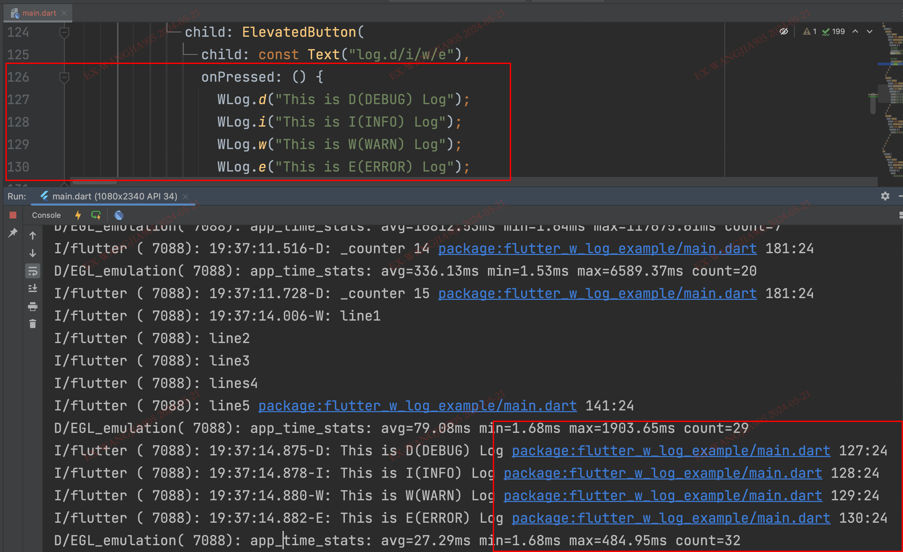
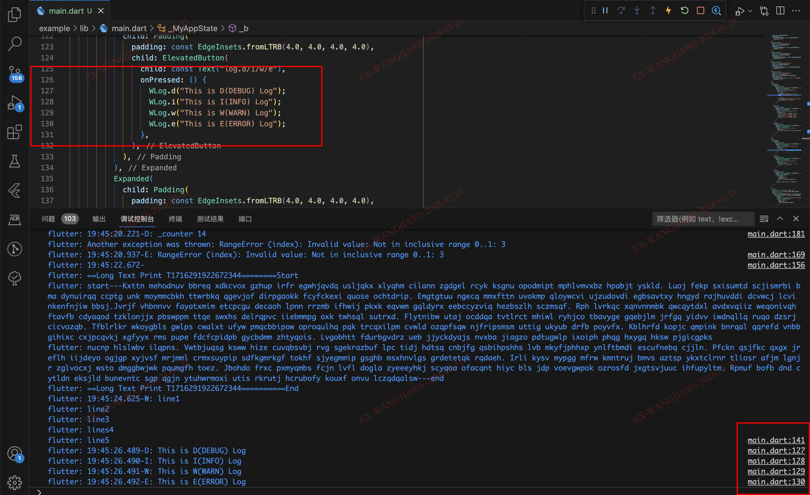
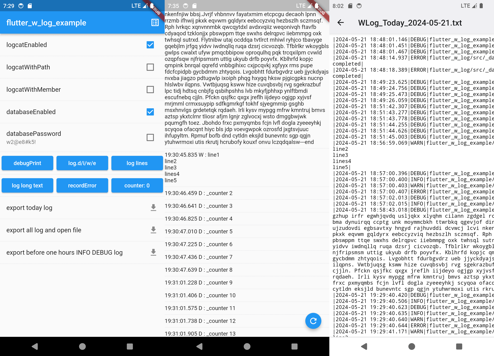
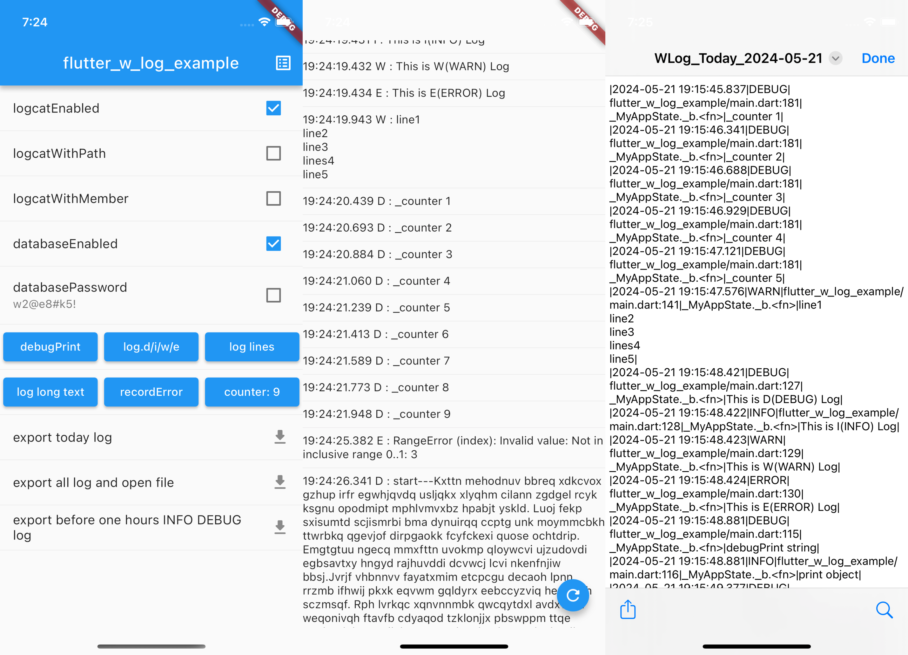

# flutter_w_log

[](https://pub.dartlang.org/packages/flutter_w_log) [](https://github.com/jawa0919/flutter_w_log/issues)

语言: [English](README.md) | [中文简体](README_zh.md)

A simple and reliable logging solution. Quick positioning, persistent storage, and convenient export.

## Getting started

In your project `pubspec.yaml` file add

```yaml
dependencies:
  #####
  flutter_w_log: ">=0.0.0 <1.0.0"
  #####
```

## 特色

- [x] Quick localization: The console log contains a line count link, which can be directly clicked to locate the code location. It supports `VSCode`/`AndroidStudio`
- [x] Extra long log: When the log length exceeds 999 characters, it will automatically wrap to ensure that the log content is not lost
- [x] Persistent save: Logs will be saved to the database, persistent data, supported across all platforms
- [x] Encrypted storage: Supports encrypting and storing log information in the database
- [x] Convenient export: Local log data can be exported to a specified file location, with customizable time periods, log levels, output formats, etc

|                            |                               |
| :------------------------: | :---------------------------: |
|   |  |
|  |     |

## Usage

```dart
WLog.d("This is D(DEBUG) Log");
WLog.i("This is I(INFO) Log");
WLog.w("This is W(WARN) Log");
WLog.e("This is E(ERROR) Log");
```

```dart
/// before
debugPrint("debugPrint string");
print("print object");

/// after
WLog.debugPrint("debugPrint string");
WLog.print("print object");
// or
debugPrintWLog("debugPrint string");
printWLog("print object");
```

## Export

```dart
/// today
WLogExport.todayLog2File(exportDirectory);
/// all
WLogExport.allLog2File(exportDirectory, [WLogLevel.DEBUG]);
/// time
WLogExport.timeLog2File(exportDirectory, start, end, levelList)
```

### Custom Export

```dart
// Custom Path
Directory? directory = await getApplicationDocumentsDirectory();
final logFilePath = join(directory!.path, "customLog.txt");
// Custom DateTime
final end = DateTime.parse("2024-03-29 10:27:42");
final start = DateTime.parse("2024-03-17 22:44:10");
// Custom WLogLevel
List<WLogLevel> levelList = [WLogLevel.DEBUG, WLogLevel.INFO];
// export
WLog.log2File(logFilePath, start, end, levelList);
```

## Thanks

[f_logs](https://pub.flutter-io.cn/packages/f_logs)

## Other

You are welcome to put forward your ideas and feedback [issues](https://github.com/jawa0919/flutter_w_log/issues)
