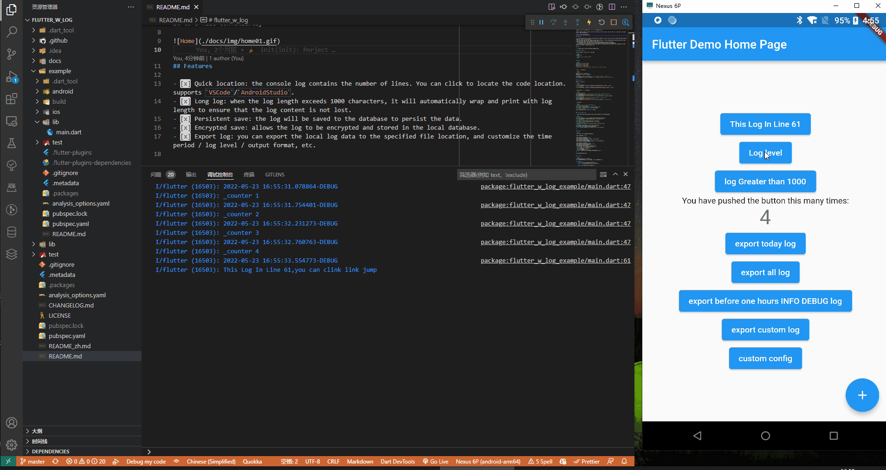
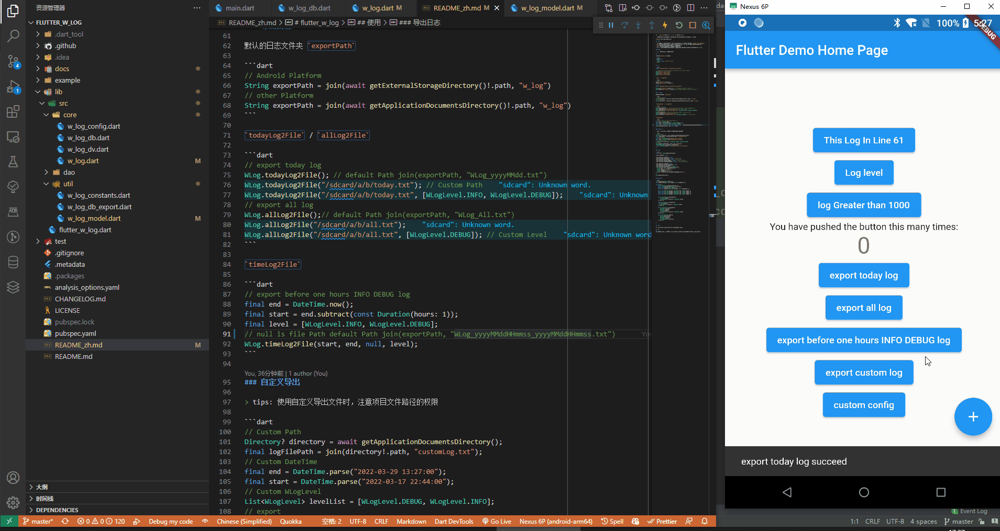

# flutter_w_log

[](https://pub.dartlang.org/packages/flutter_w_log) [](https://github.com/jawa0919/flutter_w_log/issues)

Language: [English](README.md) | [中文简体](README_zh.md)

Simple logging scheme. Quickly locate the location of the log code, save the log for a long time, and export it to a file conveniently



## Features

- [x] Quick location: the console log contains the number of lines. You can click to locate the code location. supports `VSCode`/`AndroidStudio`.
- [x] Long log: when the log length exceeds 1000 characters, it will automatically wrap and print with log length to ensure that the log content is not lost.
- [x] Persistent save: the log will be saved to the database to persist the data.
- [x] Encrypted save: allows the log to be encrypted and stored in the local database.
- [x] Export log: you can export the local log data to the specified file location, and customize the time period / log level / output format, etc.

### Todo

- [ ] Delete log: filter and delete database logs

## Getting started

In your project `pubspec.yaml` file add

```yaml
dependencies:
  #####
  flutter_w_log: ">=0.0.0 <1.0.0"
  #####
```

## Usage

```dart
WLog.e("This is Error Log");
WLog.w("This is Warn Log");
WLog.d("This is Debug Log");
WLog.i("This is Info Log");
// typedef void i(String message, {DateTime? now, Frame? frame});
```

`print` / `debugPrint`

```dart
// before
print("_counter $_counter");
debugPrint("_counter $_counter");
// after
WLog.print("_counter $_counter"); // or printWLog("_counter $_counter");
WLog.debugPrint("_counter $_counter"); //or debugPrintWLog("_counter $_counter");
```

`recordError`

```dart
  runZonedGuarded(
    () {
      WidgetsFlutterBinding.ensureInitialized();
      runApp(const MyApp());
    },
    (error, stackTrace) {
      recordError(error, stackTrace);
    },
  );
```

### Export Log

default `exportPath`

```dart
// Android Platform
String exportPath = join(await getExternalStorageDirectory()!.path, "w_log")
// other Platform
String exportPath = join(await getApplicationDocumentsDirectory()!.path, "w_log")
```

`todayLog2File` / `allLog2File`

```dart
// export today log
WLog.todayLog2File(); // default Path join(exportPath, "WLog_yyyyMMdd.txt")
WLog.todayLog2File("/sdcard/a/b/today.txt"); // Custom Path
WLog.todayLog2File("/sdcard/a/b/today.txt", [WLogLevel.INFO, WLogLevel.DEBUG]);
// export all log
WLog.allLog2File();// default Path join(exportPath, "WLog_All.txt")
WLog.allLog2File("/sdcard/a/b/all.txt");
WLog.allLog2File("/sdcard/a/b/all.txt", [WLogLevel.DEBUG]); // Custom Level
```

`timeLog2File`

```dart
// export before one hours INFO DEBUG log
final end = DateTime.now();
final start = end.subtract(const Duration(hours: 1));
final level = [WLogLevel.INFO, WLogLevel.DEBUG];
// null is file Path default Path join(exportPath, "WLog_yyyyMMddHHmmss_yyyyMMddHHmmss.txt")
WLog.timeLog2File(start, end, null, level);
```

### Custom Export Log

> tips: When using custom export files, pay attention to file permissions

```dart
// Custom Path
Directory? directory = await getApplicationDocumentsDirectory();
final logFilePath = join(directory!.path, "customLog.txt");
// Custom DateTime
final end = DateTime.parse("2022-03-29 13:27:00");
final start = DateTime.parse("2022-03-17 22:44:00");
// Custom WLogLevel
List<WLogLevel> levelList = [WLogLevel.DEBUG, WLogLevel.INFO];
// export
WLog.log2File(logFilePath, start, end, levelList);
ScaffoldMessenger.of(context).showSnackBar(
  const SnackBar(content: Text("export custom log succeed")),
);
```



### Config

```dart
final _conf = WLog.getDefaultConfig();

_conf.isEnabled = true;

_conf.dvConfig.isEnabled = true;
_conf.dvConfig.isWithLevel = true; // print Level
_conf.dvConfig.isWithFrame = true; // print Link
_conf.dvConfig.isWithFileName = false; // print File Name
_conf.dvConfig.isWithMethodName = false; // print Method Name
_conf.dvConfig.debugPrintWrapWidth = 1024; // print Wrap Width

_conf.dbConfig.isEnabled = true;
_conf.dbConfig.encryptionEnabled = false;
_conf.dbConfig.encryptionKey = "";
_conf.dbConfig.exportForma = (WLogModel m) {
  String time = m.t?.toIso8601String() ?? "";
  String level = m.l?.name ?? "";
  String fileName = m.f ?? "";
  String methodName = m.m ?? "";
  return "|$time|$level|$fileName|$methodName|${m.s}|";
};

WLog.applyConfig(_conf);
```

## WLog.dart

```dart
void printWLog(Object? object) {}
void debugPrintWLog(String? message, {int? wrapWidth}) {}

class WLog {
    static WLogConfig getDefaultConfig() {}
    static void applyConfig(WLogConfig config) {}

    static void print(Object? object) {}
    static void debugPrint(String? message, {int? wrapWidth}) {}

    static void d(String message, {DateTime? now, Frame? frame}) {}
    static void i(String message, {DateTime? now, Frame? frame}) {}
    static void w(String message, {DateTime? now, Frame? frame}) {}
    static void e(String message, {DateTime? now, Frame? frame}) {}

    static Future<File> todayLog2File([
        String? filePath,
        List<WLogLevel> levelList = WLogLevel.values,
    ]) async {}

    static Future<File> allLog2File([
      String? filePath,
      List<WLogLevel> levelList = WLogLevel.values,
    ]) async {}

    static Future<File> timeLog2File(
        DateTime startTime, [
        DateTime? endTime,
        String? filePath,
        List<WLogLevel> levelList = WLogLevel.values,
    ]) async {}

    static Future<File> log2File(
        String logFilePath, [
        DateTime? startTime,
        DateTime? endTime,
        List<WLogLevel>? levelList,
    ]) async {}

}
```

## Thanks

[f_logs](https://pub.flutter-io.cn/packages/f_logs)

## Other

You are welcome to put forward your ideas and feedback [issues](https://github.com/jawa0919/flutter_w_log/issues)
