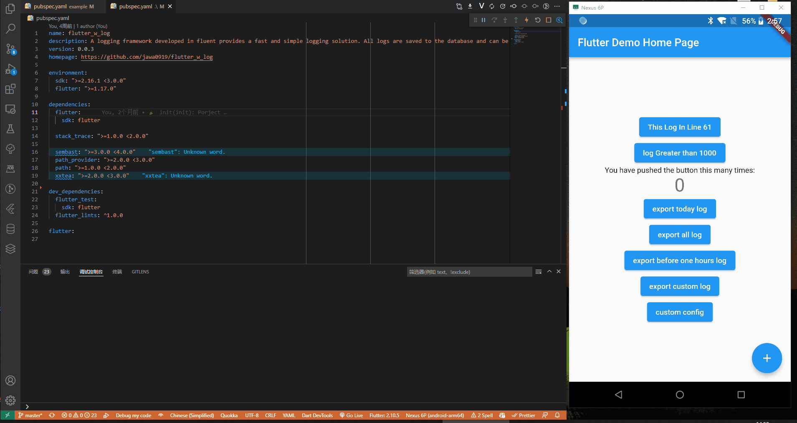

# flutter_w_log

[](https://pub.dartlang.org/packages/flutter_w_log) [](https://github.com/jawa0919/flutter_w_log/issues)

语言: [English](README.md) | [中文简体](README_zh.md)

简单可靠的日志方案。快速定位日志代码的位置，持久保存日志，便捷将其导出为文件



## 特色

- [x] 快速定位：控制台日志包含行数 link，可以点击定位到代码位置，支持 `VSCode`/`AndroidStudio`
- [x] 超长日志：日志长度超过 1000 个字符时，自动换行使用 log 长打印，保证日志内容不丢失
- [x] 持久保存：日志会保存到数据库中，持久化数据
- [x] 加密保存：允许将日志加密存储到本地数据库中
- [x] 导出日志：可以将本地日志数据导出到指定文件位置，可自定义时间段/日志级别/输出格式等

### Todo

- [ ] 删除日志：筛选删除数据库日志

## 开始

在项目的`pubspec.yaml`文件添加

```yaml
dependencies:
  #####
  flutter_w_log: ">=0.0.0 <1.0.0"
  #####
```

## 使用

```dart
import 'package:flutter_w_log/flutter_w_log.dart';

// typedef void d(String message, {DateTime? now, Frame? frame});
WLog.e("This is Error Log");
WLog.w("This is Warn Log");
WLog.d("This is Debug Log");
WLog.i("This is Info Log");
```

`print` / `debugPrint`

```dart
// before
print("_counter $_counter");
debugPrint("_counter $_counter");

// after
import 'package:flutter_w_log/flutter_w_log.dart';

WLog.print("_counter $_counter");// or printWLog("_counter $_counter");
WLog.debugPrint("_counter $_counter");//or debugPrintWLog("_counter $_counter");
```

### 导出日志

默认的日志文件夹 `exportPath`

```dart
// Android Platform
String exportPath = join(await getExternalStorageDirectory()!.path, "w_log")
// other Platform
String exportPath = join(await getApplicationDocumentsDirectory()!.path, "w_log")
```

`todayLog2File` / `allLog2File`

```dart
// export today log
WLog.todayLog2File(); // default Path join(exportPath, "WLog_yyyyMMdd.txt")
WLog.todayLog2File("/sdcard/a/b/today.txt"); // Custom Path
WLog.todayLog2File("/sdcard/a/b/today.txt", [WLogLevel.INFO, WLogLevel.DEBUG]);
// export all log
WLog.allLog2File();// default Path join(exportPath, "WLog_All.txt")
WLog.allLog2File("/sdcard/a/b/all.txt");
WLog.allLog2File("/sdcard/a/b/all.txt", [WLogLevel.DEBUG]); // Custom Level
```

`timeLog2File`

```dart
// export before one hours INFO DEBUG log
final end = DateTime.now();
final start = end.subtract(const Duration(hours: 1));
final level = [WLogLevel.INFO, WLogLevel.DEBUG];
// null is file Path
WLog.timeLog2File(start, end, null, level);
```

### 自定义导出

> tips: 使用自定义导出文件时，注意项目文件路径的权限

```dart
// Custom Path
Directory? directory = await getApplicationDocumentsDirectory();
final logFilePath = join(directory!.path, "customLog.txt");
// Custom DateTime
final end = DateTime.parse("2022-03-29 13:27:00");
final start = DateTime.parse("2022-03-17 22:44:00");
// Custom WLogLevel
List<WLogLevel> levelList = [WLogLevel.DEBUG, WLogLevel.INFO];
// export
WLog.log2File(logFilePath, start, end, levelList);
ScaffoldMessenger.of(context).showSnackBar(
  const SnackBar(content: Text("export custom log succeed")),
);
```

### 配置

```dart
final _conf = WLog.getDefaultConfig();

_conf.isEnabled = true;

_conf.dvConfig.isEnabled = true;
_conf.dvConfig.isWithLevel = true; // print Level
_conf.dvConfig.isWithFrame = true; // print Link
_conf.dvConfig.isWithFileName = false; // print File Name
_conf.dvConfig.isWithMethodName = false; // print Method Name

_conf.dbConfig.isEnabled = true;
_conf.dbConfig.encryptionEnabled = false;
_conf.dbConfig.encryptionKey = "";
_conf.dbConfig.exportForma = (WLogModel m) {
  String time = m.t?.toIso8601String() ?? "";
  String level = m.l?.name ?? "";
  String fileName = m.f ?? "";
  String methodName = m.m ?? "";
  return "|$time|$level|$fileName|$methodName|${m.s}|";
};

WLog.applyConfig(_conf);
```

## WLog.dart

```dart
void printWLog(Object? object) {}
void debugPrintWLog(String? message, {int? wrapWidth}) {}

class WLog {
    static WLogConfig getDefaultConfig() {}
    static void applyConfig(WLogConfig config) {}
    static void print(Object? object) {}
    static void debugPrint(String? message, {int? wrapWidth}) {}

    static void d(String message, {DateTime? now, Frame? frame}) {}
    static void i(String message, {DateTime? now, Frame? frame}) {}
    static void w(String message, {DateTime? now, Frame? frame}) {}
    static void e(String message, {DateTime? now, Frame? frame}) {}


    static Future<File> todayLog2File([
        String? filePath,
        List<WLogLevel> levelList = WLogLevel.values,
    ]) async {}

    static Future<File> allLog2File([
      String? filePath,
      List<WLogLevel> levelList = WLogLevel.values,
    ]) async {}

    static Future<File> timeLog2File(
        DateTime startTime, [
        DateTime? endTime,
        String? filePath,
        List<WLogLevel> levelList = WLogLevel.values,
    ]) async {}

    static Future<File> log2File(
        String logFilePath, [
        DateTime? startTime,
        DateTime? endTime,
        List<WLogLevel>? levelList,
    ]) async {}

}
```

## 感谢

[f_logs](https://pub.flutter-io.cn/packages/f_logs)

## 其他

欢迎大家提出想法和反馈问题 [issues](https://github.com/jawa0919/flutter_w_log/issues)
