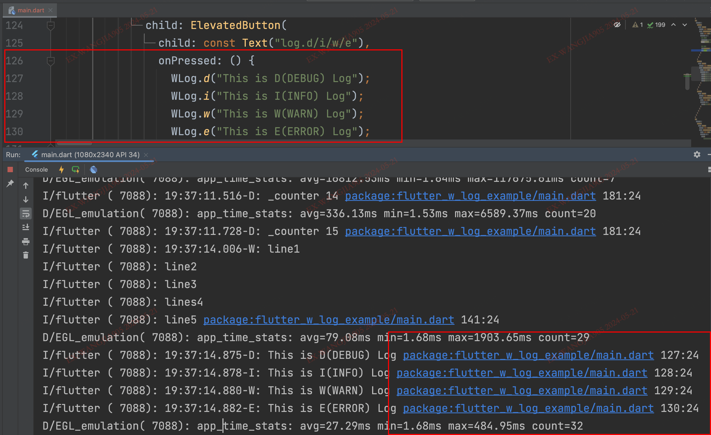
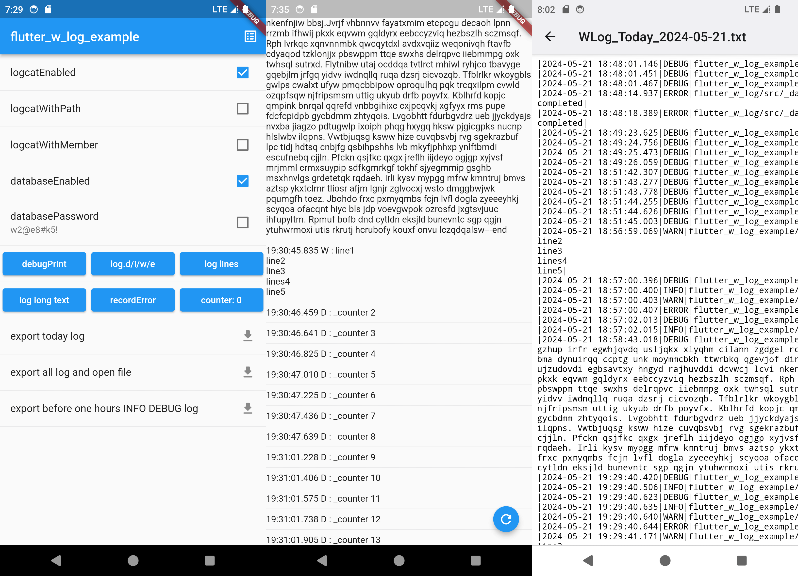

# flutter_w_log

[](https://pub.dartlang.org/packages/flutter_w_log) [](https://github.com/jawa0919/flutter_w_log/issues)

语言: [English](README.md) | [中文简体](README_zh.md)

简单可靠的日志方案。快速定位，持久保存，便捷导出。

## 引入

在项目的`pubspec.yaml`文件添加

```yaml
dependencies:
  #####
  flutter_w_log: ">=0.0.0 <1.0.0"
  #####
```

## 特色

- [x] 快速定位：控制台日志包含行数 link，可以直接点击定位到代码位置，支持 `VSCode`/`AndroidStudio`
- [x] 超长日志：日志长度超过 999 个字符时，自动换行，保证日志内容不丢失
- [x] 持久保存：日志会保存到数据库中，持久化数据，全平台支持
- [x] 加密保存：支持将日志信息加密存储到数据库中
- [x] 便捷导出：可以将本地日志数据导出到指定文件位置，可自定义时间段/日志级别/输出格式等

|                            |                               |
| :------------------------: | :---------------------------: |
|   |  |
|  |     |

## 使用

```dart
WLog.d("This is D(DEBUG) Log");
WLog.i("This is I(INFO) Log");
WLog.w("This is W(WARN) Log");
WLog.e("This is E(ERROR) Log");
```

```dart
/// before
debugPrint("debugPrint string");
print("print object");

/// after
WLog.debugPrint("debugPrint string");
WLog.print("print object");
// or
debugPrintWLog("debugPrint string");
printWLog("print object");
```

## 导出

```dart
/// today
WLogExport.todayLog2File(exportDirectory);
/// all
WLogExport.allLog2File(exportDirectory, [WLogLevel.DEBUG]);
/// time
WLogExport.timeLog2File(exportDirectory, start, end, levelList)
```

### 自定义导出

```dart
// Custom Path
Directory? directory = await getApplicationDocumentsDirectory();
final logFilePath = join(directory!.path, "customLog.txt");
// Custom DateTime
final end = DateTime.parse("2024-03-29 10:27:42");
final start = DateTime.parse("2024-03-17 22:44:10");
// Custom WLogLevel
List<WLogLevel> levelList = [WLogLevel.DEBUG, WLogLevel.INFO];
// export
WLog.log2File(logFilePath, start, end, levelList);
```

## 感谢

[f_logs](https://pub.flutter-io.cn/packages/f_logs)

## 其他

欢迎大家提出想法和反馈问题 [issues](https://github.com/jawa0919/flutter_w_log/issues)
